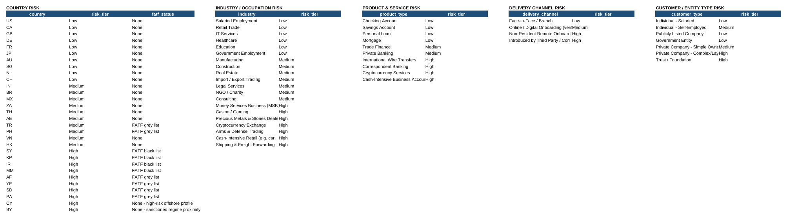
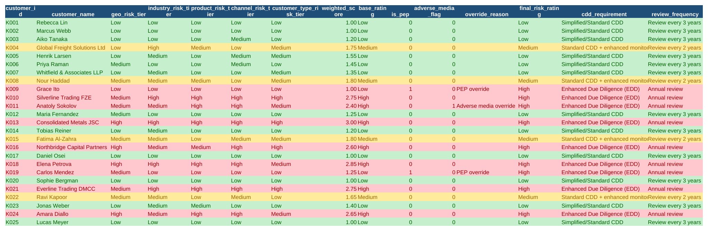

# Customer Risk Assessment & Risk Rating Model (Excel)

A no-code customer risk rating model for KYC/CDD, implementing a
standard **FATF risk-based approach (RBA)** — built entirely in
Excel formulas.

## Why this project

A customer's risk rating is what drives everything downstream in a
KYC program: how much due diligence is required at onboarding
(Simplified CDD, Standard CDD, or Enhanced Due Diligence), how often
the file gets reviewed, and how much weight transaction monitoring
alerts on that account should carry. This workbook builds that
scoring logic end to end — five weighted risk factors, a composite
score, and override rules for PEP status and adverse media that a
weighted average alone would dangerously dilute.

## What's in this repo

```
Customer_Risk_Rating_Model.xlsx     ← the main workbook (open this)
README.md
data/
  customers.csv                     ← customer book, standalone CSV
  country_risk_reference.csv        ← geographic risk lookup table
  industry_risk_reference.csv       ← industry/occupation risk lookup table
  risk_weights.csv                  ← the scoring policy (factor weights)
  risk_assessment_output.csv        ← computed results, exported as CSV
screenshots/
  reference_tables.png
  risk_assessment.png
```

## Workbook structure

| Tab | Purpose |
|---|---|
| `README` | Methodology (same content as this file, for anyone who only opens the workbook) |
| `Risk_Weights` | The scoring policy — which factors count and how much |
| `Reference_Tables` | Five lookup tables mapping categories to Low/Medium/High risk tiers |
| `Customers` | The customer book being assessed — 25 synthetic customers |
| `Risk_Assessment` | The scoring engine — every formula, one row per customer |

Open `Risk_Assessment` and click any cell to see the live formula
behind it — nothing is hardcoded or pasted as a value.

## The risk model

**Five weighted risk factors** (standard FATF RBA categories):

| Factor | Weight | What it captures |
|---|---|---|
| Geographic Risk | 25% | Customer's country, including FATF grey/black list status |
| Industry / Occupation Risk | 20% | Cash-intensive, MSB, precious metals, etc. score higher than salaried employment |
| Product & Service Risk | 20% | Cross-border wires, correspondent banking, crypto services score higher than a plain checking account |
| Customer / Entity Type Risk | 15% | Complex/layered ownership, trusts, and foundations score higher than individuals |
| Delivery Channel Risk | 20% | Non-resident remote onboarding and third-party introduction score higher than face-to-face |

Each factor is looked up against its reference table, converted to a
1 (Low) / 2 (Medium) / 3 (High) score, and combined into a weighted
composite score.

**PEP status and adverse media are override triggers, not weighted
factors.** A customer who is a confirmed PEP, or has a confirmed
adverse media hit, is automatically rated High risk regardless of
their weighted score. This mirrors real program design — averaging
a PEP flag into a weighted score would let an otherwise-clean profile
dilute a factor regulators expect to be decisive on its own. The
workbook shows both the calculated base rating *and* the override
reason side by side, so an analyst can see exactly why a customer
landed where they did.

## Key formulas used

All standard Excel:

- **`INDEX`/`MATCH`** — pulling each customer's risk tier from all
  five reference tables.
- **Nested `IF`** — converting Low/Medium/High tiers to a 1/2/3
  numeric score, and turning the final weighted score into a
  plain-English rating.
- **Weighted sum** — combining five factor scores with their policy
  weights (pulled live from the `Risk_Weights` sheet) into one
  composite score.
- **`OR`** — implementing the PEP/adverse-media override without
  disturbing the underlying weighted score.
- **Conditional formatting** — red/amber/green by final risk rating.

## Results

Running the model against the 25 synthetic customers produces a
realistic spread: 13 Low, 4 Medium, 8 High (6 naturally high-scoring,
plus 2 forced High by an override that a weighted score alone would
have missed or underweighted).

**The two override cases are the most important rows in the sheet:**

| Customer | Weighted score alone | Override | Final rating |
|---|---|---|---|
| K009 — Grace Ito | 1.00 (Low) | PEP override | **High** |
| K011 — Anatoly Sokolov | 2.40 (already High) | Adverse media override | **High** |

Grace Ito's underlying profile — low-risk country, industry, product,
and channel — would score Low on the weighted model alone. The PEP
override catches what the weighted average would have missed
entirely, which is exactly the design intent.





## A note on thresholds and weights

The specific weights (25/20/20/15/20) and the Low/Medium/High score
cutoffs (2.3 and 1.6 on a 1–3 scale) are **policy choices, not fixed
math**. A real institution calibrates and periodically re-validates
these against its actual risk appetite, customer base, and regulator
expectations — they're not universal constants. They're intentionally
exposed as editable inputs on the `Risk_Weights` sheet rather than
buried inside formulas, since a risk model a compliance team can't
re-tune without rewriting formulas isn't one they can actually govern.

## Limitations (stated honestly)

- Synthetic data only — 25 customers, sized for a readable
  demonstration. A live program scores an entire customer book and
  re-scores it on every material change (new address, new product,
  adverse media hit).
- Only two override triggers (PEP, adverse media) are modeled; a
  production program typically also overrides on sanctions nexus,
  negative regulatory history, and certain product combinations.
- The reference tables are illustrative category-to-tier mappings,
  not derived from a validated risk assessment methodology — a real
  program's tables are approved policy documents, revisited on a
  set cadence.
- No handling of a customer's risk changing over time (a "trigger
  event" re-rating workflow) — this model produces a point-in-time
  rating only.

## About

Built by Biswajit Das, CAMS-certified compliance analyst, as a
portfolio piece demonstrating KYC/CDD risk-based-approach logic
without a coding dependency.
